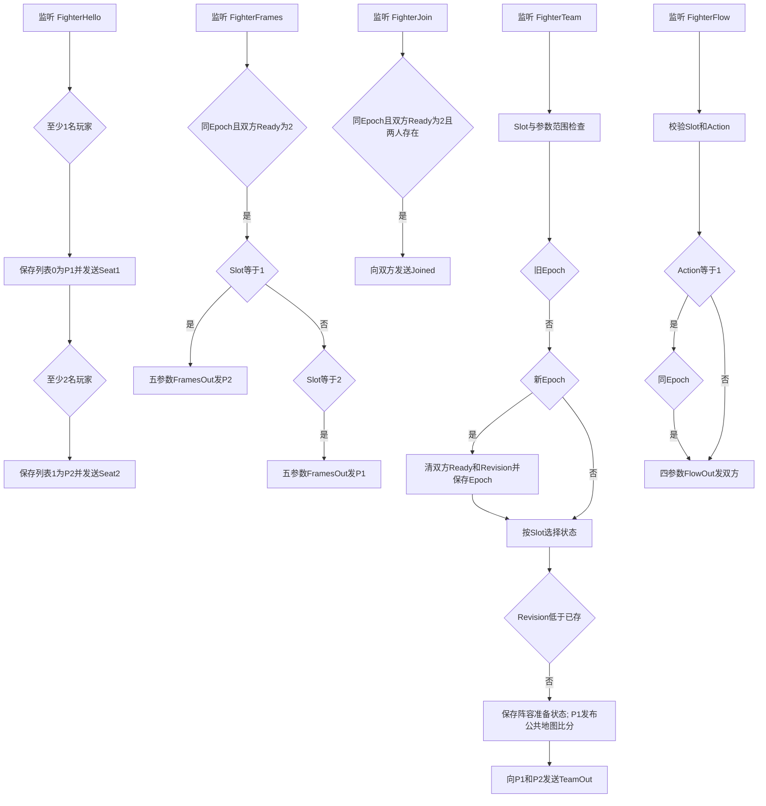

# 当前联机节点图的业务结构

这是当前生成候选的逻辑总览，原始节点号与连线见generated-logic.json。官方导入尚待验证。

```mermaid
flowchart TD
 H[监听 FighterHello] --> HC{至少1名玩家}
 HC --> HP[保存列表0为P1并发送Seat1]
 HP --> H2{至少2名玩家}
 H2 --> HQ[保存列表1为P2并发送Seat2]
 T[监听 FighterTeam] --> V[Slot与参数范围检查]
 V --> E{旧Epoch}
 E -- 否 --> N{新Epoch}
 N -- 是 --> R[清双方Ready和Revision并保存Epoch]
 N -- 否 --> S[按Slot选择状态]
 R --> S
 S --> RV{Revision低于已存}
 RV -- 否 --> SAVE[保存阵容准备状态; P1发布公共地图比分]
 SAVE --> TO[向P1和P2发送TeamOut]
 J[监听 FighterJoin] --> JR{同Epoch且双方Ready为2且两人存在}
 JR -- 是 --> JO[向双方发送Joined]
 F[监听 FighterFrames] --> FE{同Epoch且双方Ready为2}
 FE -- 是 --> FS{Slot等于1}
 FS -- 是 --> FP2[五参数FramesOut发P2]
 FS -- 否 --> FS2{Slot等于2}
 FS2 -- 是 --> FP1[五参数FramesOut发P1]
 L[监听 FighterFlow] --> LV[校验Slot和Action]
 LV --> LA{Action等于1}
 LA -- 是 --> LE{同Epoch}
 LE -- 是 --> LO[四参数FlowOut发双方]
 LA -- 否 --> LO
```

没有通过的分支结束，不改状态。Team在Ready1/2时额外验证三角色非零且不同；新Epoch重置两方Ready/Revision，然后保存当前收到的席位快照。相同Revision可广播补回包。Flow退出相邻Epoch和版本由当前客户端检查。
